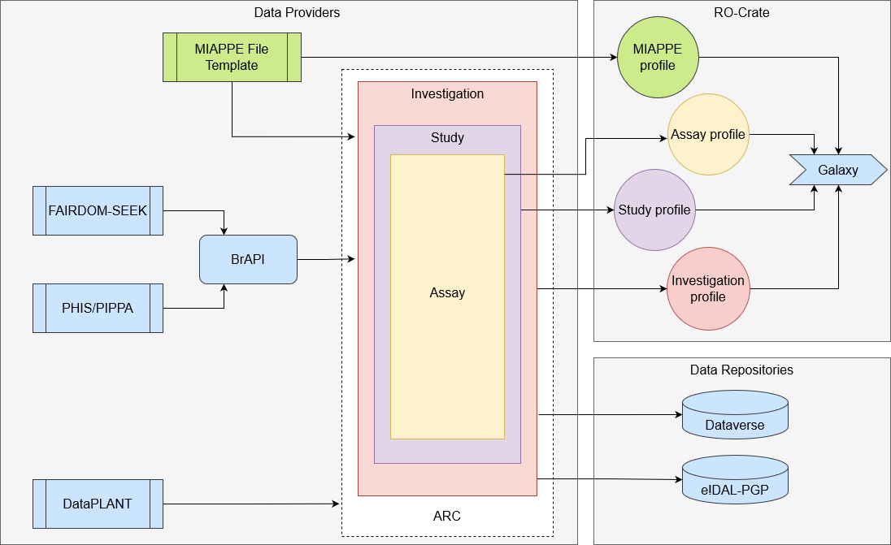

# Introduction

The overall goal of this year's BioHackathon Europe project, initiated by the ELIXIR Plant Sciences Community, was to improve shared plant data standards in terms of their interoperability. Several technologies and data formats for plant science have already been created in the past. These include in particular the [MIAPPE](https://www.miappe.org/) metadata standard (Minimal Information on Plant Phenotyping Experiments), which can define a dataset of phenotyping experiment in its completeness [@citesAsAuthority:Papoutsoglou2020]. 

Some elements require extra attention to enable FAIR reusability and interoperability of MIAPPE datasets and particularly the way biological samples are described and identified. Not only is the exact taxonomic name recorded here, but also information about the lineage, passport data which include the variety identification as well as the sampling, the developmental stage and the anatomical entity for molecular assays. MIAPPE is implemented in databases, web services such as [Breeding API](https://brapi.or) [@citesAsAuthority:Selby2019]) and file sets commonly represented as tables. 

The [MIAPPE training template](https://github.com/MIAPPE/MIAPPE/tree/master/MIAPPE_Checklist-Data-Model-v1.1/MIAPPE_templates) demonstrate this, as well as a MIAPPE ISA-Tab implementation using the [ISA framework](https://isa-tools.org/format/specification.html/) (Investigation-Study-Assay), either as ISA-Tab or ISA JSON [@citesAsAuthority:Rocca_Serra2010]. The Breeding API allows data retrieval and transfer programmatically via RESTful services either as whole datasets or by subsellecting relevant dataset parts. 

In order to make plant experimental datasets findable, websites in which such datasets are described may be annotated using Schema.org. While Schema.org does not provide domain-specific keywords, several projects aim to extend Schema.org. For the life sciences, [Bioschemas](https://www.bioschemas.org/) [@citesAsAuthority:gray2017] is one such effort. 

The main components of MIAPPE are already supported by Bioschemas, such as the biological material and the traits and enable already efficient findability. But the plant community wants to go beyond that and represent the connection between phenomics and other data domains, e.g. omics-based data, using technologies like knowledge graphs. For that objective, significant shortcomings still remain and hardly any method exist to integrate data from these data domains.

During the ELIXIR BioHackathon Europe 2021, first groundwork had been established to fully map Bioschemas and MIAPPE. Certain fields were still under discussion, because it was not possible to unambiguously map every one of them. A desired outcome of the BioHackathon 2022 was the completed and finalised mapping between MIAPPE and Bioschemas. 

Furthermore a second important outcome was to identify open issues for applying the ISA data model and the MIAPPE standard for novel data containers, especially RO-Crate and ARC and pass a roadmap for the next steps to improve the mapping.

# The ISA framework

The open source ISA framework [@citesAsAuthority:Rocca_Serra2010], for reporting experimental work in life sciences, helps plant scientists manage a diverse range of experiments using one or a combination of data modalities and technologies. The framework is centered around three entities: Investigation (the project or dataset), Study (the experimental setup) and Assay (the description of analytical measurements or transformation of data). 

The idea is that data models and serialisations (tabular, JSON and RDF) help experimentalists to provide a comprehensive description of the entire experimental metadata (biological material and sample characteristics, technology and protocols used, measurement types and data transformation, relationships between samples and data) so that the results and findings generated can be reproduced and reused by other scientists.

## DataPLANT Data Management 

The DataPLANT consortium (https://www.nfdi4plants.de), which is part of the German [NFDI](https://www.nfdi.de/?lang=en) (National Research Data Infrastructure), adopted the ISA model to describe various types of plant experiments and built a data structure called [ARC](https://nfdi4plants.org/nfdi4plants.knowledgebase/docs/implementation/AnnotatedResearchContext.html/) (annotated research context). It relies on ISA for experimental metadata,  [CWL](https://www.commonwl.org/) for computational metadata, and [git](https://git-scm.com/) & [git-lfs](https://git-lfs.github.com/) for data storage. The approach allows version control, long term reproducible workflows for 'wet' and 'dry' labs and complete user access and provenance. 

To collect experimental metadata, DataPLANT has developed MS Excel-based tools, available as a plug-in called [SWATE](https://nfdi4plants.org/nfdi4plants.knowledgebase/docs/implementation/Swate.html). The experimental metadata is conveniently stored in Excel spreadsheets (.xlsx) and can be marked up with ontology terms thanks to Excel widget performing terminology lookups over a community-driven ontology service. This service allows to crowdsource ontology management and therefore helps to bridge the ontology gap.

During the BioHackathon, the issue of documentating recommended ISA implementation patterns was also raised. The outcome of these discussions have been [consolidated in a specific github issue](https://github.com/ISA-tools/isa-api/issues/474). Of particular interest and importance was the agreement to refer to CWL workflows from an ISA archive through ISA protocol objects, therefore providing an elegant solution to the issue of interoperation between two data standards covering different areas of concerns.

## ISA applied in Plant Phenotyping

An existing ISA MIAPPE [mapping](https://github.com/MIAPPE/MIAPPE/tree/master/MIAPPE_Checklist-Data-Model-v1.1/MIAPPE_mapping) and [config](https://github.com/MIAPPE/ISA-Tab-for-plant-phenotyping) had already been published[@citesAsAuthority:cwiek-kupczynska_measures_2016] and improved [@citesAsAuthority:Papoutsoglou2020]. While it proved its efficiency, harmonisation and documentation are still needed with sample datasets ([DROPS](https://doi.org/10.15454/IASSTN) and [IPK Arabidopsis](http://dx.doi.org/10.5447/ipk/2020/3)). 

Based on those examples, the BioHackathon discussions showed the need to better formalise data files and their relationships. Indeed, MIAPPE datasets can contain (i) the "raw" data with direct measures on the microplots or plants (*i.e.* 
2a-GrainYield_components_Plot_level.tab in the [DROPS](https://doi.org/10.15454/IASSTN) example ), as well as (ii) the derived data computed from several files of the first level (*i.e.* [BLUEs](https://doi.org/10.57745/RRETIO) or [genotype indices](https://doi.org/10.15454/IASSTN/CQDQ8B)) 
2a-GrainYield_components_Plot_level.tab in the [DROPS](https://doi.org/10.15454/IASSTN) example ). 

Current ISA specifications only describe the process on how results were obtained and not the actual result values and does not describe the relationships between datafiles, *i.e.* the provenance. The discussions led to the following proposals:

1. Provenance handling
    1. CWL seems a promising way to easily express the relationship between files. A CWL file could be added to the ISA archive for this purpose and referenced as a datafile property. 
2. Data handling
    1. Keep results in a separate file linked in the assay table [(git)](https://github.com/ISA-tools/isa-api/issues/475). Best practices for the external data file organisation should also be promoted [(git)](https://github.com/MIAPPE/MIAPPE/issues/71).
    1. Extend the assay tables to include `measurement values`. This should be avoided for larger number of results [(git)](https://github.com/ISA-tools/isa-api/issues/473).

# Packaging ISA with RO-Crate

For simple and lightweight archiving and packaging, the scientific community has created the [RO-Crate](https://www.researchobject.org/ro-crate/) data standard. It is based on [Schema.org](https://www.schema.org/) markup annotations in [JSON-LD](https://json-ld.org/) and aims to make best practices for formal metadata description accessible and workable. In this context, an RO-Crate is a structured archive of all elements that have contributed to a research result, including their identifiers and origins. RO-Crate, therefore, is very generic and can easily receive any ontology of formalism to describe its content. 

Thus, it would be quite feasible to create a profile for the handling of ISA and MIAPPE. However, this would increase the maintenance workload for the community and the available tools need to be adapted to handle this profile. At the same time, such RO-Crate ISA profiles are of great interest for other use cases, such as [Seek4science](https://seek4science.org/) or [Galaxy](https://usegalaxy.eu/). As a consequence, the proposition is to clarify and improve the MIAPPE ISA implementation and to develop multiple RO-Crate-ISA profiles that wil allow to encapsulate MIAPPE datasets through ISA, hence bringing the expected interoperability. 

RO-Crates ISA (either ISA JSON, ISA-Tab or ISA.xlsx) should rely on four RO-Crate profiles with a flat and disentangled ISA structure. This avoids nested data structures, which is necessary for tools such as GALAXY. 

As a rule of thumb, the annotation scheme used to describe the dataset should be more general at the top of the hierarchy. For ISA, this means that the Investigation object should be described using very general terms, while the Study objects are described using less general terms and the Assay objects are described using specific terms.

**1. ISA-Investigation Profile:**
Description of the ISA `Investigation` object only relying on Schema.org for type definitions. This enables to find and harvest datasets, e.g. via Google Dataset Search. 

**2. ISA-Study Profile:**
Description of an individual ISA `Study` relying on [Bioschemas](https://bioschemas.org/) for type definitions (where possible).

**3. ISA-Assay Profile:** 
Description of an ISA`Assay` in question relying on ISA terminology.

**4. MIAPPE Profile:** 
Description of special MIAPPE related fields, not directly describable in Schema.org, Bioschemas, or ISA terms.

# Formalising the MIAPPE use case in Bioschemas

[Bioschemas](https://bioschemas.org/) is an extension of the Schema.org project to cover life science data. Similarly to Schema.org, it aims at providing with a lightweight data semantics, which might be easier to use in situations such as annotating web pages or automatically exporting and integrating data if the data is modelled with informal semantics that go beyond traditional OWL-based ontologies.

During the BioHackathon, we continued the work started in 2021, first during the [ELIXIR Implementation Study on Bioschemas](https://elixir-europe.org/internal-projects/commissioned-services/exploiting-bioschemas-markup-support-elixir-communities) and then during the BioHackathon by mapping the entities and fields in the MIAPPE specifications to Bioschemas types and defining extensions and modifications for the latter where necessary. 

This will allow in the future to support cases like converting ISA datasets about field trials into Bioschemas-based RDF serializations (formats like [Turtle](https://www.w3.org/TR/turtle/) or [JSON-LD](https://www.w3.org/TR/json-ld11/)). BrAPI-to-Bioschemas has also been proposed and is facilitated by the fact that the BrAPI API specification for breeding trial data is already mapped to MIAPPE and ISA-Tab.

The [details of this work](https://github.com/Rothamsted/agri-schemas/tree/master/doc/miappe-use-case) are reported on the [Agri-Schemas repository](https://github.com/Rothamsted/agri-schemas). Agri-Schemas is a project with the similar goal of using (or extending) Bioschemas to cover a wide range of agri-food related data, including molecular biology, field trials, weather data, agro-forestry. 

Once these data are represented by a common data standard such as Bioschemas, it will be possible to support a use case such as: 1) Building a knowledge base from web pages annotated with Bioschemas, or 2) Using a SPARQL endpoint to answer queries such as: What are the genotypes that give high yields in field trials and what biological processes are the genes involved in? Preliminary datasets on this basis have been published by the Knetminer team by importing data from Ensembl Plants [@citesAsAuthority:bolser_ensembl_2016] and the EBI Gene Expression Atlas [@citesAsAuthority:kapushesky_2009], among others.

# FAIR Cookbook recipe on describing MIAPPE datasets as ISA
<!--Introduction to FAIR cookbook -->
During the discussions, we realised that several challenges related to the mapping of MIAPPE-compliant phenomic datasets to the ISA model have often caused confusion in their implementation in the past. In addition, some of the previously described mappings need to be formalised and concretised to help data producers and data curators to ensure a consistent representation of the data. 

Therefore, we agreed to author a [FAIR cookbook](https://faircookbook.elixir-europe.org/content/home.html) recipe explaining how to describe common plant phenotypic studies in a MIAPPE-compliant way as an ISA dataset [@citesAsAuthority:rocca_serra_philippe_2022_6783564]. This can probably be a subsection or a mature variant of an "ISA" recipe. The basis for this recipe could be the existing description from the https://github.com/MIAPPE/ISA-Tab-for-plant-phenotyping repository. It already contains various sections for the different ISA components and needs only minor additions and modifications.

# Future developments beyond the BioHackathon Europe 2022

Both MIAPPE and ISA (and the combination of both standards) will be improved through revised documentation and demonstration of best practises, including more sample datasets. The two ELIXIR data management portals [FAIR cookbook](https://faircookbook.elixir-europe.org/content/home.html) and [RDMkit](https://rdmkit.elixir-europe.org) will be used for this purpose. 

A dedicated recipe will be published in the FAIR cookbook and referenced in the [RDMkit plant phenomics tools assembly](https://rdmkit.elixir-europe.org/plant_phenomics_assembly) as well as on www.miappe.org.

In parallel, the necessary extensions of ISA for data processing and provenance tracability will be discussed at the end of 2022 with the aim of implementation in mid-2023.

## Building RO-Crate profiles
The proposed RO-Crate profiles will need to be developed and implemented in close collaboration with the Galaxy use case.

Information systems such as [PHIS](http://www.phis.inra.fr/) or [PIPPA](https://www.psb.ugent.be/phenotyping/pippa) are able to generate MIAPPE compliant ISA datasets via BrAPI endpoints. The same is true for [Seek4science](https://seek4science.org/). Without these systems, it is also possible to create ISA data directly using the MIAPPE file templates or as an export from an [ARC](https://github.com/nfdi4plants/ARC-specification/blob/main/ARC%20specification.md).

For the import of such MIAPPE compliant ISA data into analysis workflow systems like [Galaxy](https://usegalaxy.eu/), different RO-Crate profiles are used to describe the data and its metadata. 

For the persistent storage of such MIAPPE compliant ISA data, various data repositories are maintained by the community, for example [e!DAL-PGP](https://edal-pgp.ipk-gatersleben.de/) or different Dataverse alternatives (data.inrae.fr, data.fz-juelich.de, dmportal.biodata.pt).

## Bioschemas
The MIAPPE/Bioschemas mapping has been finalised during the BioHackathon. We will demonstrate it by implementing the ISA-Tab and/or BrAPI converters mentioned above, which we will use to enrich the existing AgriSchemas-based datasets and develop use cases for data search and analysis. 

An example of the latter is a [student's project](https://github.com/Rothamsted/knetgraphs-gene-traits) developed within the Knetminer team, which shows the potential of Bioschemas-based knowledge graphs to extend the approach of gene-set enrichement analysis.

## Acknowledgements

This work was funded by ELIXIR, the research infrastructure for life-science data. Discussions and work were conducted during the ELIXIR BioHackathon 2022 in Paris, France. SSR was funded by Horizon Europe (BY-COVID [101046203](https://doi.org/10.3030/101046203)).

## References
